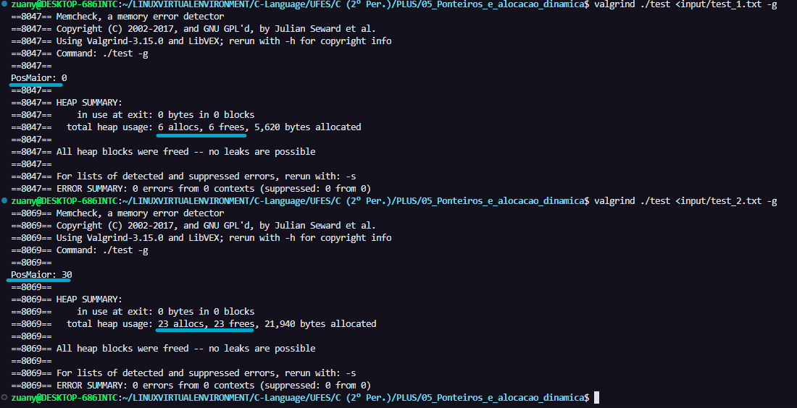
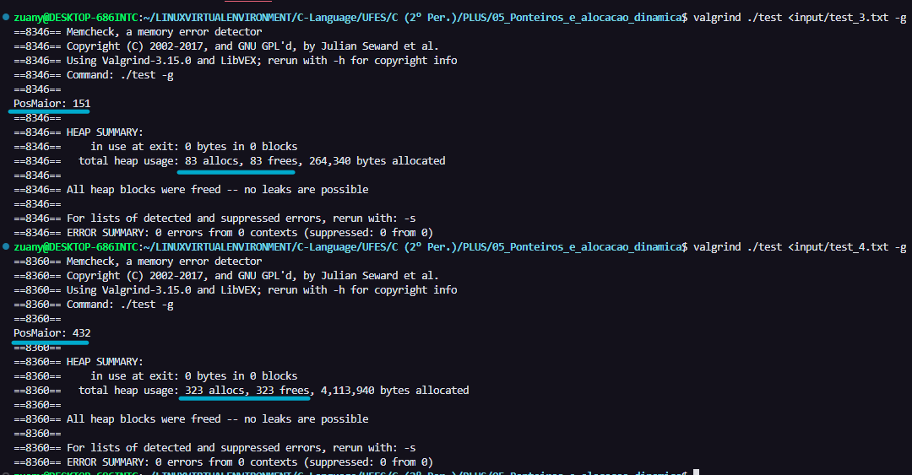

# Respostas

## Malloc

1. Cria um ponteiro e aloca 10 X o tamanho do tipo int (4*10 = 40 bytes).  
2. Aloca dinamicamente o numero de bytes que a variavel x ocupa (caso eu altere o tipo de variavel, não será necessário alterar esse trecho de código).  
 
---

## Free
3. Na hora de liberar a memória com o free(v+1), o programa libera todas as posições alocadas exceto a posição 0. 
4. O erro se encontra na criação do v[3]. Essa varável será destruida no fim da função ja que foi declarada no escopo local. Para corrigir esse erro, deveria ter utilizado o malloc.
 

5. 
   ~~~C
   void FreeMem(int** mat, int m){
      //m = linhas
      for (int i = 0; i < m; ++i){
         free(mat[i]);
      }
      free(mat);
   }
   ~~~
    

6. 
   ~~~C
    #include <stdio.h>
    #include <stdlib.h>

    int** AlocaMem(int m, int n);
    void LiberaMem(int** mat, int m);

    int main(){
        int m, n;
        int **M;
        scanf("%d %d", &m, &n);    
        M = AlocaMem(m, n);
        LiberaMem(M, m);
        return 0;
    }

    int** AlocaMem(int m, int n){
        int i;
        int **M;
        M = malloc (sizeof (int *) * m);
        for (i = 0; i < m; ++i){
            M[i] = malloc (n * sizeof (int));
        }
        return M;
    }

    void LiberaMem(int** mat, int m){
        //m = linhas
        for (int i = 0; i < m; ++i){
            free(mat[i]);
        }
        free(mat);
    }
   ~~~
    

7. 
   ~~~C
    #include <stdio.h>
    #include <stdlib.h>
    #include <string.h>

    int PosicaoDoMaior(int *vet, int max);
    void *meurealloc(int *vet, unsigned int size);

    int main(){
        int i = 0, pos = 0, tamanhoTotal = 0, inicial = 5;
        int *vet  = malloc(sizeof(int)*inicial);

        while(scanf("%d", &vet[i])== 1){
            i++;
            if(i%5==0){// a cada 5 valores inseridos amplia em +5 (40 bytes) o numero de posicoes totais do vetor.
                tamanhoTotal+=5;
                vet = (int *)meurealloc(vet, tamanhoTotal*sizeof(int));
            }    
        }

        printf("PosMaior: %d\n", PosicaoDoMaior(vet, tamanhoTotal));
        free(vet);
        
        return 0;
    }

    void *meurealloc(int *vet, unsigned int size){
        int *VetorAmpliado = malloc(sizeof(int)*size);
        VetorAmpliado = memmove(VetorAmpliado, vet, size);//move para o VetorAmpliado o conteudo do vet que tem size bytes.
        free(vet); 
        return VetorAmpliado;
    }

    int PosicaoDoMaior(int *vet, int max){
        int maior, pos, count = 0, i;

        for(i=0; i<max; i++){
            if(i==0){ // setar o valor da posicao 0 como o maior;
                maior = vet[0];
                pos = 0;
                continue;
            }
            if(*(vet+i) > maior){ //busca o maior.
                maior = *(vet+i);
                pos =  i;
            }
        }

        for(i=0; i<max; i++){
            if(*(vet+i) == maior){ // retornar a posicao 0 caso haja 2 valores maximos iguais.
                count++;
            }
            if(count == 2){
                return 0;
            }
        }
        return pos;
    }

   ~~~

    
   
   ---
    

   ### Teste 1 e 2:  
    

   ---

    

   ### Teste  3 e 4:  
   